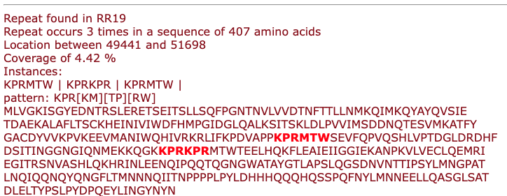

# Cyclopeptide BGC detection 

This module supports the detection of cyclopeptide BGCs in the presence of a BURP domain and repeat sequences. 

The Cyclopeptide detection module identifies biosynthetic gene clusters (BGCs) associated with cyclopeptide production in plants.
Detection is based on two main criteria:

- The presence of a BURP domain (a characteristic biosynthetic domain).

- The presence of internal amino acid repeats within coding sequences, suggesting the existence of cyclopeptide precursor peptides.

Once a putative BGC is detected, the module performs the following steps:

1. Repeat Detection: Using a repeat-finding algorithm, the module scans the coding sequences (CDSs) inside the cluster for repeated amino acid motifs.

- From the plantiSMASH CLI, the  `--require-internal-cyclopeptide-repeats` argument allows a more restrictive mining method for putative cyclopeptide BGCs, where repeat detection takes place only inside the limits of the BURP feature, leading to fewer proposed cyclopeptide hits.

1. Pattern Matching: Detected repeats are matched against known cyclopeptide-related patterns where available, or reported as new motifs.

2. Filtering Logic: Only clusters containing both a BURP domain and at least one repeat with appropriate features are retained.

3. Result Summary: For each coding sequence with detected repeats, the module reports:

   - The identified repeat patterns.

   - The number of repeat instances.

   - The location and sequence coverage.

A visual highlight of the repeats inside the amino acid sequence.

The output includes a detailed view showing the repeat locations, pattern matches, and highlighted sequences.

## Known Cyclopeptide Motif Detection

This module includes detection of **known amino acid repeat motifs** that are commonly found in plant cyclopeptides. These motifs are defined using regular expressions to flexibly capture conserved sequence patterns, including tolerated variability.

The following known motifs are currently supported:

| Motif Name                                | Regex Pattern      | Description |
|-------------------------------------------|--------------------|-------------|
| **Lyciumins**                              | `QP.{5}W`           | Glutamine–Proline followed by any 5 residues and a Tryptophan. |
| **Legumenin**                              | `QP.{3}Y.W`         | Glutamine–Proline with 3 residues, a Tyrosine, any residue, and a Tryptophan. |
| **Bicyclic cyclopeptide alkaloid**         | `.{1}L.{1}Y..Y`     | Leucine at position 2, Tyrosines spaced within six residues. |
| **DUF2775 core peptide (Pfam: PF10905)**   | `VS[AI]Y`           | Conserved Valine–Serine followed by Alanine or Isoleucine, and Tyrosine. |
| **DUF2775 leader peptide (Pfam: PF10905)** | `FEPR`              | Short leader motif with Phenylalanine–Glutamate–Proline–Arginine. |
| **Cca-like peptide**                       | `QI.{2}W`           | Glutamine–Isoleucine followed by any two residues and a Tryptophan. |
| **Stephanotic acid-like**                 | `QL.{2}W`           | Glutamine–Leucine followed by any two residues and a Tryptophan. |
| **Valine–Tyrosine pattern**                | `V.{2}Y`            | Valine followed by any two residues and a Tyrosine. |

### Notes:
- These motifs are used to **identify known cyclopeptide-related repeats** in coding sequences.
- Only matches **within CDS features containing internal repeats** are considered.
- The list of motifs is defined in `known_motifs.txt` (one regex per line).

### Customising the module 
You can easily extend `known_motifs.txt` to support additional motifs for other peptide classes.

