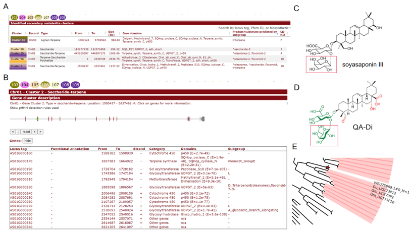

# Subgroup identification module

plantiSMASH includes a subgroup identification module that helps predict substrate specificities for enzyme subfamilies in plant biosynthetic gene clusters. Currently, this module supports several key protein families: cellulose synthases, UDP-glucuronosyltransferases (UDPGTs), short-chain dehydrogenases (SDRs), and oxidosqualene cyclases (OSCs).

The workflow combines:

- HMMER to detect domain-containing proteins,

- pplacer to phylogenetically place these proteins onto precomputed reference trees, and

- GraPhlAn to generate interactive and color-coded visualizations.

How it works

1. Domain detection: The target genome is scanned with profile HMMs to detect relevant domains.

2. Phylogenetic placement: Identified protein sequences are placed onto curated reference trees using pplacer.

3. Subgroup inference: If a target protein's neighboring nodes in the tree belong to a consistent known subgroup, it is inferred to belong to that subgroup.

4. HMM matching: Separately, the full-length protein is scored against subgroup-specific HMMs. If the top-scoring subgroup matches the pplacer result, this is marked as high-confidence.

5. Visualization: Color-coded trees are generated with GraPhlAn to display placements and subgroup contexts.

Interpreting results
In the cluster overview, when a subgroup is detected for a gene, a clickable label is shown. Clicking on the detected subgroup name will open an interactive phylogenetic tree showing the target protein and its neighbors, colored by subgroup.

Subgroup predictions that align with known biosynthetic product types are marked with an asterisk *. If no consistent assignment is possible, or if the HMMER and pplacer results disagree, the module presents both results for user inspection.

## Customization
This module is modular and can be extended to support additional protein families or custom subgroup definitions. For detailed instructions on how to customize the subgroup analysis (e.g. adding new reference trees or HMMs), please refer to the [plantiSMASH Wiki](https://github.com/plantismash/plantismash/wiki). 
