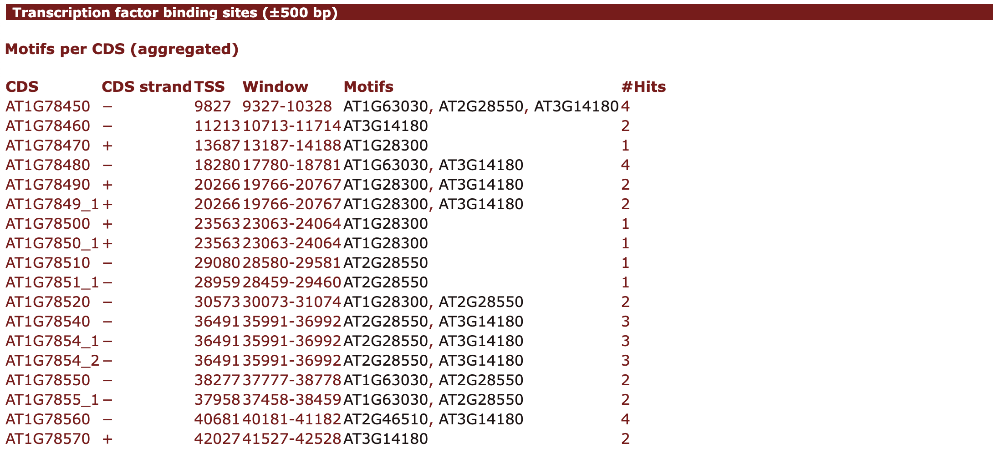
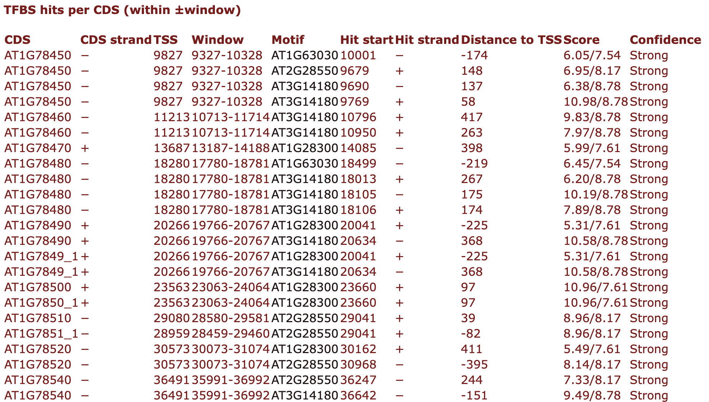
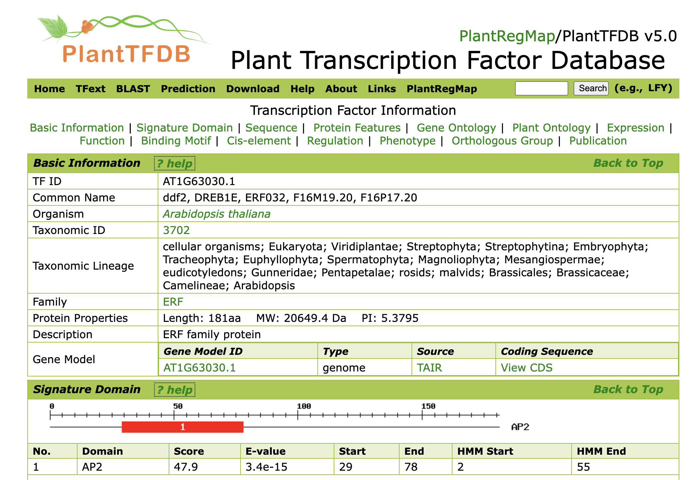

# Transcription Factor Binding Site (TFBS) Prediction


This module predicts **Transcription Factor Binding Sites (TFBSs)** around genes and displays the results inside plantiSMASH cluster pages. It uses curated motif matrices (from PlantTFDB) and the **MOODS** scanner for fast, strand-aware motif search on DNA.

---

## Method overview

1. **Motif library**  
   A JSON file provides a set of TFBS profiles (one per TF) as 4×N matrices (A,C,G,T by position) and metadata (name, species, PlantTFDB link, consensus, min/max score).

2. **Where we scan**  
   For each CDS in the contig, we take a window centered on the **transcription start site (TSS)**:
   - **+ strand CDS:** `TSS = CDS.start`
   - **− strand CDS:** `TSS = CDS.end - 1`  
   A half-window `W` is applied on both sides, i.e. `[TSS − W, TSS + W]`.  
   (In cluster pages, only CDS that overlap the cluster are reported.)

3. **How we scan**  
   Each window is scanned **on both strands** with MOODS using a motif-specific score threshold derived from a user-supplied **p-value**. Background nucleotide frequencies are estimated from the scanned window and assumed symmetric (A=T and C=G).

4. **Hit filtering and reporting**  
   MOODS returns all hits scoring above the per-motif threshold. Hits are then:
   - collected per CDS window,
   - reported with position, strand, distance to TSS, score,
   - aggregated per CDS (unique motif names and hit counts).

---

## MOODS-based scanning

We rely on [MOODS](https://github.com/jhkorhonen/MOODS) for exact, high-performance scanning:

- **Matrix type:** the module accepts PFMs or log-odds matrices. If any value is negative, the matrix is treated as **log-odds**; otherwise it is treated as a **PFM** and converted to log-odds with MOODS, using the window’s background distribution and a small pseudocount.
- **Thresholds from p-value:** for each motif, MOODS computes a score threshold `thr` such that random hits exceed `thr` with probability `p` under the background model.
- **Strands:** both forward and reverse-complement strands are scanned. Reverse hits are reported in **forward coordinates**.

---

## Confidence labels (Weak / Medium / Strong)

Each hit is labeled by comparing its score to **per-motif** min/max score statistics from the JSON:

- **Weak:** `score ≤ min_score`  
- **Strong:** `score ≥ (min_score + max_score)/2`  
- **Medium:** otherwise

> These labels are **not** the p-value; they bucket scores relative to each motif’s observed score range. If you curate `min_score`/`max_score`, labels will track your expectations.

---

## Input matrix format (JSON)

The file contains a top-level dictionary keyed by motif/TF name:

```json
{
  "AT1G28300": {
    "name": "AT1G28300",
    "description": "Unknown transcription factor",
    "species": "Arabidopsis thaliana",
    "link": "https://planttfdb.gao-lab.org/tf.php?sp=Ath&did=AT1G28300.1",
    "consensus": "ATGCATGC",
    "max_score": 7.6068,
    "min_score": 0.0214,
    "pwm": [
      [0.661184, 0.002475, ...],   // A row, length = motif length
      [0.332237, 0.002475, ...],   // C row
      [0.003289, 0.002475, ...],   // G row
      [0.003289, 0.992574, ...]    // T row
    ]
  }
}
```

> Notes
> - `pwm` can be PFM (non-negative, typically columns sum to ~1) or log-odds (can contain negatives). The module auto-detects.
> - `min_score` and `max_score` are used only for confidence labels.
> - `link` is shown in the HTML output (motif names become links). Legacy http://planttfdb.cbi.pku.edu.cn/... links are automatically mapped to https://planttfdb.gao-lab.org/....


## Parameters & CLI usage

Enable TFBS scanning and control sensitivity from the plantiSMASH CLI:

```bash 
python run_antismash.py \
  --tfbs-detection \
  --tfbs-pvalue 1e-4 \
  --tfbs-range 500 \
  --taxon plants \
  --outputfolder results/my_run \
  my_sequences.gbff

```

Arguments

`--tfbs-detection`
Turn on the TFBS module.

`--tfbs-pvalue FLOAT`
Per-motif p-value used by MOODS to derive scan thresholds (e.g., 1e-4).

`--tfbs-range INT`
Half-window size (bp) around each CDS TSS to scan (e.g., 500 scans [TSS−500, TSS+500]).

> Example in this documentation
> The *A. thaliana* results shown here were generated with p = 0.0001 and ±500 bp.

## Output 

This module adds a **“Transcription factor binding sites (±W bp)”** panel to each cluster page with two data tables:

1. **Motifs per CDS (aggregated)**  
   Summarizes which motifs occur within the window around each CDS TSS.
   - **CDS:** gene label (from `locus_tag`, `gene`, or `protein_id`)  
   - **CDS strand:** orientation of the gene (+/−)  
   - **TSS:** coordinate used as transcription start site (TSS)  
   - **Window:** displayed portion of the scanned interval (clipped to cluster bounds)  
   - **Motifs:** unique TF motif names found in the window  
   - **#Hits:** total number of motif matches across those motifs



2. **TFBS hits per CDS (within ±window)**  
   Full list of individual hits that pass the MOODS threshold.
   - **CDS / CDS strand / TSS / Window:** as above  
   - **Motif:** **clickable** motif name that links to the corresponding PlantTFDB TF page  
   - **Hit start:** genomic start (forward axis) of the match  
   - **Hit strand:** strand of the match (+/−)  
   - **Distance to TSS:** signed distance (negative = upstream, positive = downstream)  
   - **Score:** MOODS match score along with the motif’s `max_score` (for context)  
   - **Confidence:** Weak / Medium / Strong (label derived from per-motif min/threshold/max; see “Confidence labels”)



> **Example settings for the screenshots in this documentation**  
> Species: *A. thaliana* — **p-value = 0.0001**, **scan window = ±500 bp** around each CDS TSS.


Hits are linked to [**PlantTFDB**](https://planttfdb.gao-lab.org/)




---

## Customization

### Use your own motif library

You can run the TFBS Finder with any set of motifs as long as they follow the expected JSON format (4×N A/C/G/T rows per motif plus metadata).

1. **Create a JSON file** in the same format as the bundled library (see “Input matrix format” above).  
2. **Place the file** in `antismash/generic_modules/tfbs_finder/data/`.  
3. **Point the module to it** by updating the path in:

```python
# antismash/generic_modules/tfbs_finder/tfbs_detection.py
PWM_PATH = utils.get_full_path(__file__, os.path.join("data", "MY_MOTIFS.json"))

```

## Tips

If your matrices are PFMs (non-negative, columns ≈ sum to 1), the module will convert them to log-odds using MOODS and the local background of each scanned window.

If your matrices are already log-odds (may include negatives), they’ll be used as-is.

The confidence labels (Weak/Medium/Strong) depend on the min_score and max_score values you provide per motif; adjust them to suit your library.


## Known limitations


Confidence labels are heuristic and rely on the min_score/max_score ranges supplied in the JSON. If your PFMs are transformed to log-odds, you may wish to re-estimate these bounds for clearer labeling.

The motif library path is configured in code (PWM_PATH). If you need to switch libraries at runtime, consider adding a small CLI option to pass a custom JSON path.
