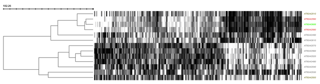
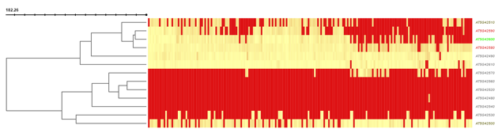

# Results overview page

The output of the plantiSMASH analysis pipeline is organized in an interactive HTML page with SVG graphics.  

Different parts of the analysis are displayed in different panels for every gene cluster. See the  
[example output](https://plantismash.bioinformatics.nl/precalc/v2/Arabidopsis_thaliana_GCF_000001735.4/index.html) from *Arabidopsis thaliana* or other species in the [precalculated results page](https://plantismash.bioinformatics.nl/precalc/v2/).

Initially, a list of identified clusters is displayed in the results page. A gene cluster can be selected for viewing by clicking its number (gene clusters are numbered in the order in which they appear on the input nucleotide sequence) in the "Select Gene Cluster" panel just below the top banner or by clicking on the colored "Cluster XX" boxes. A click on "Overview" brings you back to the overview list.
Gene cluster buttons are color-coded by predicted secondary metabolite type.

In the upper panel, `Gene cluster description`, information is given about each gene cluster that was detected. In the upper line, the biosynthetic type and location of the gene cluster are displayed. Underneath this title line, all genes present in a detected gene cluster are outlined.

Clicking the `Overview` button will bring you back to the overview of predicted clusters.

At the top left of the page is the plantiSMASH `Version` information.Direct comparisons between plantiSMASH results should use the same version for consistency, as results can change between versions.

Hovering over a gene with the mouse will prompt the gene name to be displayed above the gene. Clicking the gene will provide more information on the gene: its annotation, its sequence similarity with other genes in the cluster, its location, and cross-links specific to that gene.

The last two columns containing comparisons to the MiBIG database will only be shown if antiSMASH was run with the [KnownClusterBlast](#knownclusterblast) option.

Genes are color-coded by their assigned enzymatic protein domain profile, which will be listed in the `Legend`. Additionally, genes will also be categorized by its predicted function, which will be displayed as different color borders.

## ClusterBLAST 

If you enabled Gene Cluster Comparative Analysis (ClusterBlast), this panel will display the top ten plant gene clusters from the `plantiSMASH ClusterBLAST database` that are most similar to a detected gene cluster, visually aligned to it. The drop-down selection menu can be used to browse through the gene clusters. Genes with the same colour are putative homologs based on significant Blast (Diamond) hits between them.

The `plantiSMASH ClusterBLAST database` is defined with a minimum of 2 domains needed from the BGC rules. 

Genes with matching colours are interrelated.
Percentage identity values per hit are shown when clicking the gene in question,
with a minimum percentage identity between genes of 30%.

It is normal to have multiple genes hitting for some types of genes. 

For more information about the module see [ClusterBLAST module](../modules/clusterblast.md)

## KnownClusterBLAST 

Shows clusters from MIBiG that are similar to the current region

## Coexpression analysis 

If coexpression data was provided (through either a .soft or .csv file), this panel will show expression information through both a hierarchically clustered heatmap and a coexpression network (see below).

You can choose to show either expression fluctuation (the rate of which expression level of a gene changes between samples), color-coded from white to black; or expression intensity (expression level of a gene related to the sample value distribution), color coded from yellow to red.

In the correlation network graph, you can see how genes within the cluster (box-shaped nodes) interact with each other, and with other genes in other clusters (ellipse-shaped nodes with solid edges and the corresponding cluster number inside) or anywhere else on the genome (ellipse-shaped nodes with dashed edges).

Additionally, by enabling the coexpression analysis, you will also get a Hiveplot overview of significant cluster-cluster interactions detected in the selected transcriptomics dataset. This can be accessed in the cluster overview screen.

## Subgroup identification module

plantiSMASH predicts substrate specificities of enzyme subfamilies for cellulose synthases, UDP-glucuronosyltransferases, short-chain dehydrogenases, and oxidosqualene cyclases, using pplacer and hmmer. The phylogenetic placement tool pplacer is used to place the target protein sequence on a precomputed reference tree. If the other members under the target parent node belong to the same subgroup, the target is considered to belong to the subgroup. In addition, GraPhlAn (Graphical Phylogenetic Analysis) is used to generate a tree image of the placement result. The HMM of each subgroup used by hmmer scan is made based on the full-length protein sequences of members in the subgroup. HMMs find matches based on the conserved positions of subgroup members, so they are also an efficient and simple method to identify subgroups of targets, especially those sequences with big differences. When the subgroup represented by the HMM with the highest match bitscore is consistent with the results from pplacer, it will be reported on the overview page that the target may have the same substrate type as those members of the subgroup. If it belongs to the product type that is predicted by the existence of core enzymes, it is specifically marked with * . For situations where the results of these two tools are inconsistent, or the target is not placed in a subgroup, users need to make their judgment based on results shown on the webpage of each cluster.

## Downloading the results 

At the top right of the page are ancillary links that may be useful.
`Download` allows you to download various parts of the results.
`About` links to information about plantiSMASH.
`Help` links to these documentation pages.
Finally, `Contact` links to a page with a form to send feedback or questions to the plantiSMASH developers.

The downward-pointing arrow will open a menu offering to download the complete set of results from the antiSMASH run, a summary Excel file and to the summary EMBL/GenBank output file. The EMBL/GenBank file can be viewed in a genome browser such as [Artemis](https://www.sanger.ac.uk/tool/artemis/).

**Results on the public webserver are only kept for ONE month and will be deleted afterwards. It is highly recommended that you download the full result set before they expire.**