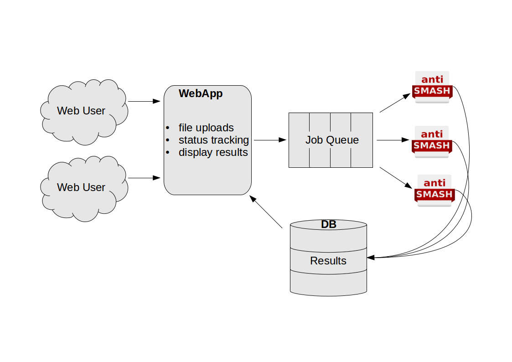

## Running the plantiSMASH web service

This is the documentation on running the whole plantiSMASH web service setup.  If
you are just interested in running antiSMASH for yourself, you might not need
this. Feel free to skip to the guide on [submitting antiSMASH jobs](website_submission.md).

Recently, we have switched the whole setup to run in [docker](https://docker.io/)
containers. Make sure you have a reasonably recent install of docker.
This guide explains how to run the whole antiSMASH web service stack on a single
machine. Larger production setups will be more complicated.

Note that it's trivial to wrap this whole setup in a `docker-compose` file, but
I'm running the appropriate commands via the docker CLI for increased
flexibility.

### Overview

There are multiple components involved in running the antiSMASH webservice.



#### Web App

The webapp is what the users interact with in their browsers. It is responsible
for starting jobs, displaying the status of running jobs, and showing the
results of completed jobs. Provided by the `antismash/websmash` image.

#### Job Queue

The job queue is taking care of tracking everything concerning jobs. It is
run on a Redis server. Provided by the `redis` image.

#### antiSMASH instances

Individual jobs are run using the antiSMASH main executable. This is wrapped by
a job runner that knows how to retrieve new jobs from the job queue, and how to
pick the correct parameters depending on the user input. Provided by the
`antismash/runsmash-lite` container.

#### Job Status Monitor

Not shown on the schema, not absolutely required, but really nice to have is the
status monitor tool that will make sure the web app can display the latest
available status. Also provided by the `antismash/runsmash-lite` container.

### Shared setup

The web app, job runners and the status monitor need to have access to a shared
directory. In this example, we will provide it on the host. In a more complex
multi-host setup, you will want to put this on a shared filesystem.
In all the below setups, the shared directory will be called
`/data/antismash/upload`. If you are using a different directory, adjust
accordingly.

### Setting up the job queue

This is straightforward and using the off the shelf `redis` image available on
the docker hub. Run it using `docker run --name antismash-redis redis`.

### Setting up the antiSMASH job runner(s)

This step requires more work. First, set up the PFAM and ClusterBlast databases
as [described for the standalone-lite
image](install.md#antismash-standalone-lite). Once the databases are all set up,
you can start up a `runSMASH` executable in the container like so:
```sh
docker run --name antismash-run01 \
           --volume /data/antismash/upload:/upload:rw \
           --volume /data/databases:/databases:ro \
           --link antismash-redis:redis \
           antismash/runsmash \
           /runsmash/runSMASH --queue redis://redis/0 \
                              --workdir /upload \
                              --statusdir /upload/status \
                              --name runner01 \
                              --cpus 8
```

Make sure to adjust the number of `--cpus` to the number you want to use per
job. You can run multiple of these job runners, just make sure you use a
different `--name` both for the `docker run` and the `runSMASH` commands.

### Setting up the antiSMASH job status monitor

This one is easier, just make sure to match the `--statusdir` to what you used
for the `runSMASH` command if you changed that. Run:
```sh
docker run --name antismash-watch \
           --volume /data/antismash/upload:/upload:rw \
           --link antismash-redis:redis \
           antismash/runsmash \
           /runsmash/watchStatus --queue redis://redis/0 \
                                 --statusdir /upload/status
```

### Setting up the antiSMASH web interface

The web interface needs a file containing some settings. You will have to adjust
those according to your local setup. An example settings file looks like this:
```python
############# Configuration #############
DEBUG = False
SECRET_KEY = "replace this by a long random string"
RESULTS_PATH = '/upload'
RESULTS_URL = '/upload'

# Flask-Mail settings
MAIL_SERVER = "mail"
DEFAULT_MAIL_SENDER = "antismash@example.org"
DEFAULT_RECIPIENTS = ["antismash@example.org"]

# Flask-Redis settings
REDIS_URL = "redis://redis/0"

#########################################
```

Assuming you have saved this file as
`/data/antismash/websmash/settings.py`, you can start the web interface
like this:
```sh
docker run --name antismash-web \
           --volume /data/antismash/upload:/upload \
           --volume /data/antismash/websmash:/config \
           --link antismash-redis:redis \
           --publish 5000:8000 \
           antismash/websmash
```

Now the antiSMASH web interface is available on your local machine at port
`5000`, ready to accept and process jobs.